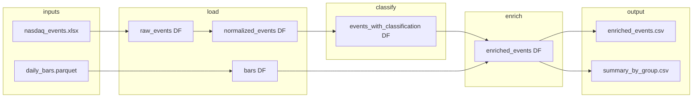

# Design Schema — Hedging Pipeline

This document describes the program architecture, data flow, and the schema of all DataFrames (inputs, intermediates, and outputs).

---

## 1. High-level architecture

The pipeline has four stages, each implemented by a dedicated class:

```
┌─────────────────────────────────────────────────────────────────────────────┐
│                           PIPELINE (orchestrator)                            │
└─────────────────────────────────────────────────────────────────────────────┘
        │
        ▼
┌───────────────────┐     ┌───────────────────┐     ┌───────────────────┐     ┌───────────────────┐
│   EventLoader      │     │  EventClassifier   │     │   PriceEnricher    │     │   SummaryStats     │
│                   │     │                   │     │                   │     │                   │
│ • load_events()   │────▶│ • classify()      │────▶│ • enrich()        │────▶│ • compute_...()   │
│ • normalize_...() │     │   (adds label)    │     │   (adds returns)  │     │ • flag_outliers() │
│ • load_daily_bars()│     │                   │     │                   │     │ • run() → CSVs    │
└───────────────────┘     └───────────────────┘     └───────────────────┘     └───────────────────┘
        │                           │                           │                           │
        │ raw_events                │ events                    │ enriched                  │ summary_df
        │ bars                      │ (same rows)               │ (same rows + cols)        │ enriched + is_outlier
        ▼                           ▼                           ▼                           ▼
   [Excel] [Parquet]           [DataFrame]                [DataFrame]              [CSV] [CSV]
```

**Data flow (in memory):**

1. **Load** — Read `nasdaq_events.xlsx` and `daily_bars.parquet`; normalize events to one row per stock action.
2. **Classify** — Add `classification` column (`event_type_action`, e.g. `adhoc_add`, `annual_del`).
3. **Enrich** — Join with bars to add entry/exit dates, prices, stock/QQQ returns, excess return, first-day return.
4. **Summarize** — Aggregate by `classification`; flag outliers; optionally write `enriched_events.csv` and `summary_by_group.csv`.

---

## 2. Data flow (Mermaid)



---

## 3. Input data schemas

### 3.1 Raw events (Excel) — `nasdaq_events.xlsx`

One row per rebalancing event (one add + one del per row). Not yet one row per stock action.

| Column (raw)           | Type     | Description                          |
|------------------------|----------|--------------------------------------|
| ANN DATE AFTER CLOSE   | datetime | Announcement date (after market close) |
| EFF DATE MORNING OF    | datetime | Effective date (change in effect morning) |
| add                    | str      | Ticker added to NASDAQ-100            |
| del                    | str      | Ticker removed from NASDAQ-100        |
| type                   | str      | `adhoc` or `ANNUAL`                  |
| TRADE EST MM           | float    | Optional; estimated trade size (MM)   |

**Validation:** Required columns must exist; invalid dates are dropped. Missing optional columns are logged.

---

### 3.2 Raw daily bars (Parquet) — `daily_bars.parquet`

One row per (date, symbol). Expected to cover event tickers and QQQ.

| Column (raw)   | Type   | Description        |
|----------------|--------|--------------------|
| Date           | object | Trading date       |
| Symbol         | str    | Ticker (e.g. QQQ, AAPL) |
| open_daily     | float  | Open price         |
| close_daily    | float  | Close price         |
| volume_daily   | int    | Volume              |

**After load:** Columns are renamed to `date`, `symbol`, `open`, `close`, `volume`; `date` is coerced to datetime; `symbol` is uppercased.

---

## 4. Intermediate DataFrames

### 4.1 Normalized events (after EventLoader)

One row per **stock action** (each add and each del from the Excel becomes its own row).

| Column       | Type     | Description                    |
|--------------|----------|--------------------------------|
| ann_date     | datetime | Announcement date              |
| eff_date     | datetime | Effective date                 |
| ticker       | str      | Ticker (add or del)            |
| action       | str      | `add` or `del`                 |
| event_type   | str      | `adhoc` or `annual` (normalized) |
| trade_est_mm  | float?   | Optional; from TRADE EST MM    |

Rows with missing ticker (e.g. NaN in add/del) are skipped.

---

### 4.2 Classified events (after EventClassifier)

Same as normalized events **plus**:

| Column         | Type | Description                                      |
|----------------|------|--------------------------------------------------|
| classification | str  | `{event_type}_{action}` e.g. `adhoc_add`, `annual_del` |

---

### 4.3 Enriched events (after PriceEnricher)

Same as classified events **plus** price/return columns. Entry = first trading day after announcement (open); exit = last trading day on or before effective date (close). QQQ is the hedge.

| Column                      | Type     | Description                                      |
|-----------------------------|----------|--------------------------------------------------|
| entry_date                  | datetime | First trading day after ann_date                 |
| exit_date                   | datetime | Last trading day ≤ eff_date                     |
| entry_open                  | float?   | Stock open on entry_date                         |
| exit_close                  | float?   | Stock close on exit_date                         |
| qqq_entry_open              | float?   | QQQ open on QQQ entry date                      |
| qqq_exit_close              | float?   | QQQ close on QQQ exit date                      |
| holding_period_trading_days | int?     | Trading days from entry to exit (inclusive)      |
| stock_return                | float?   | (exit_close - entry_open) / entry_open          |
| qqq_return                  | float?   | (qqq_exit_close - qqq_entry_open) / qqq_entry_open |
| excess_return               | float?   | stock_return - qqq_return                        |
| first_day_return            | float?   | (close - open) / open on entry_date for stock   |

Missing prices or dates yield NaN in return columns; such events remain in the DataFrame but are excluded from summary stats.

---

## 5. Output DataFrames and files

### 5.1 Enriched events with outliers — `enriched_events.csv`

Schema = **Enriched events** (above) **plus**:

| Column     | Type   | Description                                                  |
|------------|--------|--------------------------------------------------------------|
| is_outlier | bool   | True if \|z-score of excess_return within group\| > threshold (default 2.0) |

Written by `SummaryStats.run()` to `output_dir/enriched_events.csv`.

---

### 5.2 Summary by group — `summary_by_group.csv`

One row per **classification** (e.g. `adhoc_add`, `adhoc_del`, `annual_add`, `annual_del`). Only events with non-null `excess_return` are included in aggregates.

| Column                          | Type   | Description                                    |
|---------------------------------|--------|------------------------------------------------|
| classification                  | str    | Group label                                    |
| event_count                     | int    | Number of events in group with valid excess_return |
| mean_excess_return              | float  | Mean of excess_return                          |
| median_excess_return            | float  | Median of excess_return                        |
| win_rate                        | float  | Fraction of events with excess_return > 0     |
| avg_holding_period_trading_days | float? | Mean of holding_period_trading_days            |
| avg_first_day_return            | float? | Mean of first_day_return                       |

Written by `SummaryStats.run()` to `output_dir/summary_by_group.csv`.

---

## 6. Component summary

| Component        | Input(s)              | Output                    |
|-----------------|------------------------|---------------------------|
| EventLoader     | events path, bars path | normalized_events DF, bars DF |
| EventClassifier | normalized_events DF  | events DF + classification |
| PriceEnricher   | classified events DF, bars DF | enriched_events DF |
| SummaryStats    | enriched_events DF     | summary DF, enriched DF + is_outlier; optional CSV writes |
| Pipeline        | paths (or config)     | enriched, summary_df, enriched_with_outliers |

---

## 7. Config and constants

- **Paths:** `config.py` defines default paths for events, bars, and output dir (with fallback to project root if `data/` missing).
- **Hedge:** All events use **QQQ** as hedge symbol.
- **Outlier threshold:** Default 2.0 standard deviations from group mean (configurable via `PipelineConfig` or CLI `--outlier-std`).
- **Logging:** Single package logger `hedging_pipeline`; configuration via `logging.ini` (see README).
